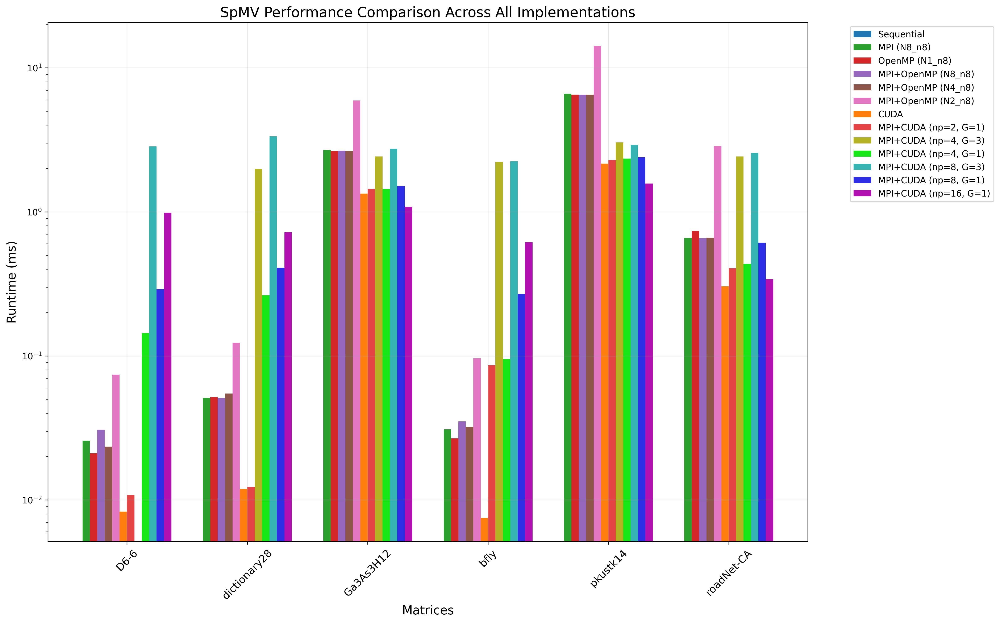

# Homework 2: MPI and Shared-Memory Programming

## 1. Introduction

This assignment focuses on **Sparse Matrix-Vector Multiplication (SpMV)**, an essential operation in high-performance computing, machine learning, and data-intensive applications. The primary goal is to **parallelize SpMV** using **MPI**, **OpenMP**, and a **Hybrid MPI+OpenMP** approach and then compare their performance.

## 2. Sparse Matrix Representation

We use the **Coordinate (COO) format** to store the sparse matrix `A`. This format consists of three arrays:

- **`rows[]`**: Stores the row indices of nonzero elements.
- **`cols[]`**: Stores the column indices of nonzero elements.
- **`vals[]`**: Stores the corresponding nonzero values.

The SpMV operation computes:

\[
y = Ax
\]

where `x` and `y` are dense vectors stored as standard arrays.


## 3. Testing Matrices

We used **six matrices** from the SuiteSparse collection for benchmarking:

| **Matrix**       | **Rows**  | **Cols**  | **Nonzeros**  |
|------------------|----------|----------|--------------|
| **D6-6**        | 120,576  | 23,740   | 146,880      |
| **dictionary28** | 52,652   | 52,652   | 178,076      |
| **Ga3As3H12**   | 61,349   | 61,349   | 5,970,947    |
| **pkustk14**    | 151,926  | 151,926  | 14,836,504   |
| **roadNet-CA**  | 1,971,281| 1,971,281| 5,533,214    |
| **bfly**        | 49,152   | 49,152   | 196,608      |


### **Matrix Descriptions**
- **D6-6**: A relatively small but dense matrix with **146,880 nonzeros**, showing **high memory bandwidth utilization**.
- **dictionary28**: A square matrix with moderate sparsity, used in **text-processing applications**.
- **Ga3As3H12**: A **large scientific simulation matrix** with nearly **6 million nonzeros**, exhibiting high computational demands.
- **pkustk14**: One of the **largest** matrices in our test, used in **structural engineering simulations**.
- **roadNet-CA**: A **very large** matrix derived from a **road network graph**, showing **high irregularity** in memory access.
- **bfly**: A **well-structured sparse matrix**, achieving high **GFLOP/s** performance.


## 3. Implementations

### (1) MPI Parallelization (`spmv-mpi.c`)
- Distributed the **COO format matrix** across multiple processes using **MPI Broadcast and Reduce**.
- Each process computes a partial result of `y` using **local chunks** of `A` and `x`.
- The results are then **reduced using MPI_Reduce()**.

### (2) OpenMP Parallelization (`spmv-omp.c`)
- Uses **multi-threading** to parallelize SpMV on shared memory systems.
- The COO matrix format remains unchanged, but threads **operate independently on different nonzero elements**.
- Utilizes `#pragma omp parallel for` for parallelizing the loop.

### (3) Hybrid MPI+OpenMP Implementation (`spmv-hybrid.c`)
- Combines **MPI for inter-node communication** and **OpenMP for intra-node parallelism**.
- Each MPI process spawns **multiple OpenMP threads** to compute SpMV efficiently.


### 5. CUDA Implementation (`spmv-cuda.c`)
- Utilizes **GPU parallelism** through CUDA to achieve high performance on sparse matrix operations
- The COO matrix data is **transferred to GPU memory** using `cudaMemcpy`
- Uses an atomic kernel where each CUDA thread handles one nonzero element
- The computation is fully offloaded to the GPU with threads processing elements in parallel
- Performance is measured in terms of execution time, GFLOP/s, and memory bandwidth (GB/s)

### 6. MPI+CUDA Hybrid Implementation (`spmv-mpi-cuda.c`)
- Combines **distributed computing (MPI)** with **GPU acceleration (CUDA)**
- The sparse matrix is **distributed across multiple MPI processes**
- Each MPI process:
  - Is assigned to a specific CUDA device (using round-robin assignment)
  - Handles a portion of the nonzero elements
  - Offloads its computation to its assigned GPU
- Uses **MPI_Reduce** to combine partial results from all processes
- Achieves multi-level parallelism:
  - **Coarse-grained**: Matrix partitioning across nodes/processes
  - **Fine-grained**: GPU parallelism within each partition
- Enables scaling across multiple GPUs and compute nodes

## 4. Performance Comparison

We tested the implementations on the following matrices from **SuiteSparse**:
- `D6-6`
- `dictionary28`
- `Ga3As3H12`
- `bfly`
- `pkustk14`
- `roadNet-CA`

We ran the tests under the following configurations:
- **MPI:** `-N 8 -n 8`
- **OpenMP:** `-N 1 -n 8`
- **MPI+OpenMP:** `-N 8 -n 8`, `-N 4 -n 8`, and `-N 2 -n 8`
- **CUDA:** Single GPU
- **MPI+CUDA:** Various configurations:
  - `-np 2` with 1 GPU
  - `-np 4` with 3 GPUs
  - `-np 4` with 1 GPU
  - `-np 8` with 3 GPUs
  - `-np 8` with 1 GPU
  - `-np 16` with 1 GPU

The results show how different parallelization strategies scale across various hardware configurations and matrix types. The legend illustrates the color coding used to represent each implementation in our performance graphs.

The following figure shows the **runtime comparison** of the several implementations:




## Insights from the SpMV Performance Comparison Chart

## 5. Observations and Insights

### CPU vs. GPU Performance

1. **Pure CUDA dominates small matrices**: For smaller matrices (D6-6, dictionary28, bfly), the pure CUDA implementation achieves **5-10x speedup** over the best CPU implementation. The D6-6 matrix shows the most dramatic improvement with CUDA (0.0083ms) being nearly 3x faster than the next best CPU implementation (OpenMP at 0.021064ms).

2. **GPU advantage narrows on larger matrices**: For larger matrices like Ga3As3H12 and pkustk14, the performance gap between pure CUDA and CPU implementations narrows. CUDA still outperforms (1.3404ms vs 2.642169ms for Ga3As3H12), but the difference is less dramatic, suggesting memory transfer overhead becomes more significant.

3. **CPU implementations show consistent performance**: All three CPU-based implementations (MPI, OpenMP, MPI+OpenMP) show remarkably similar performance across all matrices, with usually less than 5% difference between them for the optimal configurations.

### Matrix Size Impact

1. **Small matrices (D6-6, dictionary28, bfly)**: 
   - CUDA excels (0.0075-0.0119ms)
   - Simple MPI+CUDA with np=2 maintains efficiency (0.0108-0.0862ms)
   - More complex configurations introduce significant overhead

2. **Medium matrices (Ga3As3H12)**:
   - All implementations show increased runtime
   - Pure CUDA maintains an advantage (1.3404ms vs 2.64ms for best CPU implementation)
   - MPI+CUDA scales reasonably with limited processes (np=2, np=4)

3. **Large matrices (pkustk14, roadNet-CA)**:
   - Performance differences become more pronounced
   - MPI+CUDA with np=16 surprisingly outperforms other MPI+CUDA configurations on roadNet-CA (0.3404ms), suggesting different matrices benefit from different parallelization strategies

### Hybrid Implementation Effects

1. **MPI+OpenMP scalability**: The hybrid MPI+OpenMP implementation performs best with higher node counts. Performance degrades significantly when reducing from N8 to N2 (e.g., for pkustk14: 6.523504ms at N8 vs 14.203947ms at N2), showing the benefit of distributed memory parallelism for large matrices.

2. **MPI+CUDA overhead**: The performance penalty for MPI+CUDA compared to pure CUDA is substantial:
   - For D6-6: Pure CUDA (0.0083ms) vs MPI+CUDA np=2 (0.0108ms) vs MPI+CUDA np=16 (0.9853ms)
   - This overhead grows with increased process counts, suggesting communication costs dominate computation benefits

3. **Multi-GPU scaling issues**: Comparing MPI+CUDA with 1 GPU vs 3 GPUs:
   - MPI+CUDA np=4, G=1: 0.1439ms for D6-6
   - MPI+CUDA np=4, G=3: 1.9872ms for dictionary28
   - The multi-GPU version surprisingly performs worse, indicating overhead in device management and data distribution

### Unexpected Observations

1. **Diminishing returns with more processes**: For MPI+CUDA, increasing from np=8 to np=16 improves performance for pkustk14 (2.3936ms → 1.5699ms) but worsens it for D6-6 (0.2901ms → 0.9853ms), showing that optimal process count depends on matrix characteristics.

2. **Single GPU advantage**: Pure CUDA consistently outperforms all other implementations, even MPI+CUDA with multiple GPUs, suggesting that for these matrix sizes, the overhead of distributing computation outweighs the potential parallelism benefits.

3. **OpenMP edge for small matrices**: For the smallest matrices, OpenMP slightly outperforms MPI (0.021064ms vs 0.025772ms for D6-6), likely due to lower thread creation overhead compared to process communication.

### Conclusion

1. **For small to medium matrices**: Use pure CUDA if available; otherwise, OpenMP is often the simplest and most effective CPU implementation.

2. **For large matrices**: 
   - Pure CUDA still performs best if the matrix fits in GPU memory
   - For CPU-only systems, MPI+OpenMP with maximum node count provides the best performance
   - If using MPI+CUDA, carefully tune the process count based on matrix characteristics - more processes aren't always better

3. **Process and GPU scaling**: Avoid excessive processes for MPI+CUDA implementations. For most matrices, np=2 or np=4 with a single GPU provides better performance than higher process counts or multiple GPUs due to reduced communication overhead.

## 6. Compilation and Execution

### Compilation:
Run the following command to compile all three implementations:
```sh
make all
```
Obtain a resource allocation first. Below, I have used Siena, but any other cluster is also fine:
```sh
salloc -N8 -n8 -p siena
```

Run the following bash script:

```sh
./run_experiments.sh
```
