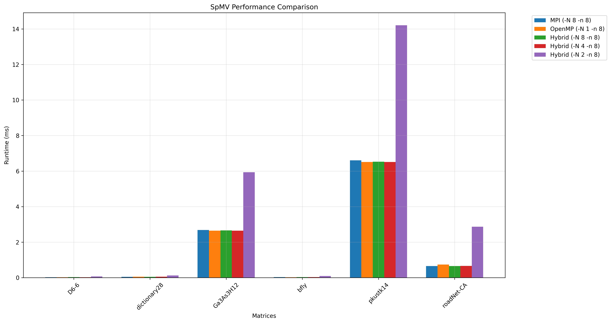

# Homework 2: MPI and Shared-Memory Programming

## 1. Introduction

This assignment focuses on **Sparse Matrix-Vector Multiplication (SpMV)**, an essential operation in high-performance computing, machine learning, and data-intensive applications. The primary goal is to **parallelize SpMV** using **MPI**, **OpenMP**, and a **Hybrid MPI+OpenMP** approach and then compare their performance.

## 2. Sparse Matrix Representation

We use the **Coordinate (COO) format** to store the sparse matrix `A`. This format consists of three arrays:

- **`rows[]`**: Stores the row indices of nonzero elements.
- **`cols[]`**: Stores the column indices of nonzero elements.
- **`vals[]`**: Stores the corresponding nonzero values.

The SpMV operation computes:

\[
y = Ax
\]

where `x` and `y` are dense vectors stored as standard arrays.


## 3. Testing Matrices

We used **six matrices** from the SuiteSparse collection for benchmarking:

| **Matrix**       | **Rows**  | **Cols**  | **Nonzeros**  |
|------------------|----------|----------|--------------|
| **D6-6**        | 120,576  | 23,740   | 146,880      |
| **dictionary28** | 52,652   | 52,652   | 178,076      |
| **Ga3As3H12**   | 61,349   | 61,349   | 5,970,947    |
| **pkustk14**    | 151,926  | 151,926  | 14,836,504   |
| **roadNet-CA**  | 1,971,281| 1,971,281| 5,533,214    |
| **bfly**        | 49,152   | 49,152   | 196,608      |


### **Matrix Descriptions**
- **D6-6**: A relatively small but dense matrix with **146,880 nonzeros**, showing **high memory bandwidth utilization**.
- **dictionary28**: A square matrix with moderate sparsity, used in **text-processing applications**.
- **Ga3As3H12**: A **large scientific simulation matrix** with nearly **6 million nonzeros**, exhibiting high computational demands.
- **pkustk14**: One of the **largest** matrices in our test, used in **structural engineering simulations**.
- **roadNet-CA**: A **very large** matrix derived from a **road network graph**, showing **high irregularity** in memory access.
- **bfly**: A **well-structured sparse matrix**, achieving high **GFLOP/s** performance.


## 3. Implementations

### (1) MPI Parallelization (`spmv-mpi.c`)
- Distributed the **COO format matrix** across multiple processes using **MPI Broadcast and Reduce**.
- Each process computes a partial result of `y` using **local chunks** of `A` and `x`.
- The results are then **reduced using MPI_Reduce()**.

### (2) OpenMP Parallelization (`spmv-omp.c`)
- Uses **multi-threading** to parallelize SpMV on shared memory systems.
- The COO matrix format remains unchanged, but threads **operate independently on different nonzero elements**.
- Utilizes `#pragma omp parallel for` for parallelizing the loop.

### (3) Hybrid MPI+OpenMP Implementation (`spmv-hybrid.c`)
- Combines **MPI for inter-node communication** and **OpenMP for intra-node parallelism**.
- Each MPI process spawns **multiple OpenMP threads** to compute SpMV efficiently.

## 4. Performance Comparison

We tested the implementations on the following matrices from **SuiteSparse**:
- `D6-6`
- `dictionary28`
- `Ga3As3H12`
- `bfly`
- `pkustk14`
- `roadNet-CA`

We ran the tests under the following configurations:
- **MPI:** `-N 8 -n 8`
- **OpenMP:** `-N 1 -n 8`
- **Hybrid:** `-N 8 -n 8`, `-N 4 -n 8`, and `-N 2 -n 8`

The following figure shows the **runtime comparison** of the three implementations:




## Insights from the SpMV Performance Comparison Chart

The bar chart illustrates the runtime (in milliseconds) of **MPI, OpenMP, and Hybrid (MPI+OpenMP) implementations** for various matrices. The x-axis represents different matrices, and the y-axis indicates the runtime in milliseconds. The different colors represent execution configurations:

- **MPI (-N 8 -n 8) (Blue)**
- **OpenMP (-N 1 -n 8) (Orange)**
- **Hybrid (-N 8 -n 8) (Green)**
- **Hybrid (-N 4 -n 8) (Red)**
- **Hybrid (-N 2 -n 8) (Purple)**

## **5. Key Observations**
### **1. Small Matrices (D6-6, dictionary28, bfly) Have Negligible Differences**
- For matrices with **fewer nonzeros** (e.g., **D6-6, dictionary28, and bfly**), all implementations **perform similarly**, with negligible runtime differences.
- This suggests that **parallelization overhead outweighs performance benefits** in very sparse or small matrices.

### **2. Large Matrices (Ga3As3H12, pkustk14, roadNet-CA) Show Clear Performance Variations**
#### **Ga3As3H12 and pkustk14:**
- **Hybrid (-N 2 -n 8) (Purple) performs significantly worse** than all other implementations.
- **MPI, OpenMP, and Hybrid (-N 8 -n 8) are nearly equivalent**, suggesting that proper **thread/process allocation balances memory access overhead**.
- **Hybrid (-N 4 -n 8) (Red) performs slightly worse** than OpenMP and MPI.

#### **roadNet-CA:**
- The **Hybrid (-N 2 -n 8) (Purple) configuration takes significantly more time** than other configurations, suggesting **excessive inter-process communication overhead** at lower node counts.
- **OpenMP, MPI, and Hybrid (-N 8 -n 8) perform similarly**, with a slight advantage for **OpenMP**.

### **3. Hybrid (-N 2 -n 8) Performs the Worst for Large Matrices**
- This suggests that a **lower number of MPI nodes (e.g., -N 2) leads to inefficient communication patterns**, negatively impacting performance.
- The extra **synchronization overhead** when using fewer MPI processes combined with OpenMP threads likely contributes to this inefficiency.

### **4. MPI vs. OpenMP vs. Hybrid (-N 8 -n 8)**
- **OpenMP (-N 1 -n 8) performs best for smaller matrices** due to lower communication overhead.
- **MPI (-N 8 -n 8) and Hybrid (-N 8 -n 8) perform similarly on large matrices**, indicating a **good balance of distributed and shared-memory processing**.
- **Hybrid (-N 2 -n 8) is the worst performer**, showing the **importance of selecting the correct number of MPI nodes**.

## **Conclusion**
- **For smaller matrices:** OpenMP alone is **sufficient** and avoids unnecessary **MPI communication overhead**.
- **For large matrices:** A properly tuned **Hybrid (-N 8 -n 8) or MPI (-N 8 -n 8) implementation performs best**.


## 6. Compilation and Execution

### Compilation:
Run the following command to compile all three implementations:
```sh
make all
```
Obtain a resource allocation first. Below, I have used Siena, but any other cluster is also fine:
```sh
salloc -N8 -n8 -p siena
```

Run the following bash script:

```sh
./run_experiments.sh
```
